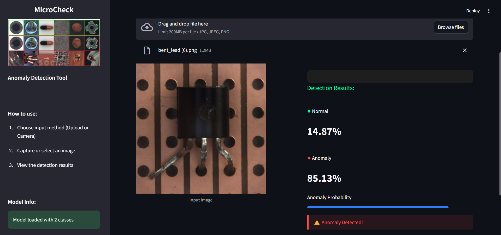

# MicroCheck: Anomaly Detection Web App 🚀



Welcome to **MicroCheck** – a modern, user-friendly web application for real-time anomaly detection in images! Built with Streamlit and TensorFlow, MicroCheck empowers you to quickly identify defects or anomalies in your products using a powerful machine learning model.

---

## 🌟 Project Overview

MicroCheck provides an intuitive interface for anomaly detection using a deep learning model trained with Google's Teachable Machine. Effortlessly upload or capture images, and instantly receive a clear, visual assessment of whether your product appears normal or anomalous.

---

## Table of Contents

- [Project Setup](#project-setup)
- [Training Your Model](#training-your-model)
- [Running the Application](#running-the-application)
- [Deployment](#deployment)
- [Customization](#customization)
- [Technical Details](#technical-details)

## Project Setup

### Prerequisites

- Python 3.8 or higher
- pip (Python package manager)

### Installation

1. Clone this repository or download the source code
2. Navigate to the project directory
3. Install the required dependencies:

```bash
pip install -r requirements.txt
```

## Training Your Model

### Step 1: Create a Teachable Machine Project

1. Visit [Teachable Machine](https://teachablemachine.withgoogle.com/) and click on "Get Started"
2. Select "Image Project" from the options
3. Choose "Standard image model"

### Step 2: Collect and Organize Training Data

1. Create at least two classes:
   - Normal (non-anomalous images)
   - Anomaly (images containing the anomalies you want to detect)
2. Add more specific classes if needed (e.g., different types of anomalies)

3. For each class:
   - Upload 30+ images for best results
   - Ensure varied lighting conditions and angles
   - Make sure images clearly represent each class

### Step 3: Train the Model with Optimized Parameters

1. Click on the "Advanced" button in the training section
2. Configure the following hyperparameters:
   - Epochs: 50-100 (higher for better results, but watch for overfitting)
   - Batch size: 16 or 32
   - Learning rate: 0.001 or 0.0005
3. Click "Train Model"
4. Wait for the training to complete and check the accuracy metrics

### Step 4: Export the Model

1. Click on "Export Model"
2. Select "Tensorflow" tab
3. Choose "Keras" option
4. Click "Download my model"
5. Extract the downloaded zip file

### Step 5: Add Model to Your Project

1. Create a `model` folder in your project directory if it doesn't exist
2. Copy the `keras_model.h5` and `labels.txt` files from the exported model into the `model` folder

## Running the Application

### Local Development

Run the application locally with:

```bash
streamlit run app.py
```

This will start the Streamlit server and open the application in your default web browser.

### Using the Application

1. The sidebar displays information about the loaded model
2. Upload an image using the file uploader
3. View the original image and detection results side by side
4. See prediction and confidence scores for each class
5. Expand the "See technical details" section for more information

## Deployment

### Deploying to Streamlit Cloud

1. Push your project to a GitHub repository
2. Visit [Streamlit Cloud](https://streamlit.io/cloud)
3. Sign in with your GitHub account
4. Click "New app"
5. Select your repository, branch, and the main file (`app.py`)
6. Click "Deploy"

Note: Make sure your repository includes the `model` folder with the required files.

## Customization

### Modifying the User Interface

- Edit the CSS styles in the `app.py` file to change colors, fonts, and layouts
- Adjust the sidebar content to include more information or instructions
- Add additional analysis features by extending the code

### Using a Different Model

You can replace the model with any Keras model that performs image classification:

1. Export a new model from Teachable Machine or use your own
2. Replace the `keras_model.h5` and `labels.txt` files in the `model` folder

## Technical Details

### Model Information

- The application uses a TensorFlow/Keras model trained with Teachable Machine
- Input shape: 224x224x3 (RGB images)
- Output: Probability distribution across classes

### Dependencies

- TensorFlow 2.13.0: Deep learning framework
- Streamlit: Web application framework
- OpenCV: Image processing
- Pillow: Image handling
- NumPy: Numerical operations

### Compatibility Notes

- The application is designed to work with Python 3.8+
- TensorFlow 2.13.0 is specified to avoid compatibility issues
- OpenCV is used in headless mode for server deployment compatibility

---

Created for educational purposes. Powered by TensorFlow and Streamlit.
